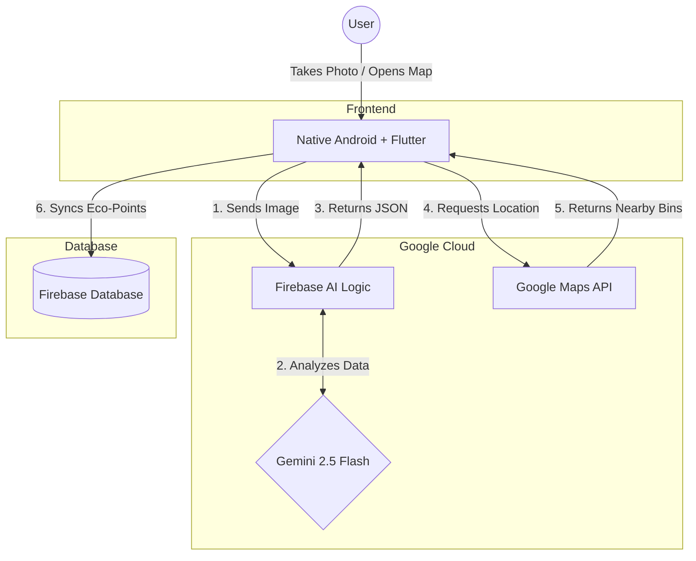

# ♻️ ChipRevive: Smart E-Waste Sorting Assistant

> **Empowering consumers to identify, upcycle, and responsibly recycle electronic waste through AI and Gamification.**

##  The Problem
The world generated a record 62 million tonnes of e-waste in 2022, yet only 22.3% was properly recycled.  The root cause? **A massive consumer knowledge gap.** People don't know how to assess the reusability of old devices or safely extract valuable parts. Fearing data breaches or lacking technical expertise, functional electronics are hoarded in drawers until they degrade, ultimately ending up in landfills and squandering $62 billion in recoverable resources annually.

##  Our Solution
**ChipRevive** is a user-friendly, AI-powered mobile application built entirely on the Google Technology Stack. It tackles the consumer knowledge barrier directly by making e-waste evaluation effortless. With a simple photo, our AI instantly identifies reusable components, provides step-by-step upcycling/recycling guidance, and seamlessly navigates users to verified drop-off locations.

###  SDG Alignment
Aligned with **SDG 12: Responsible Consumption and Production (Target 12.5)**, ChipRevive shifts public behavior from hoarding and dumping to actively rescuing functional parts, cultivating a sustainable circular economy.

---

##  Core Features
* **AI E-Waste Scanner:** Snap a photo of any broken device. The app uses Gemini 2.5 Flash to instantly classify the item, flag hazardous materials (e.g., swollen batteries), and suggest whether to reuse or recycle.
* **Smart Location Routing:** Bridges the digital-to-physical gap. Uses Google Maps API to instantly locate nearby, verified specialized e-waste recycling centers.

##  User Feedback & Iteration
We validated ChipRevive with real users (university students & young adults) and iterated based on **3 key insights**:
1. **Insight: Unpredictable UI Needs.** Users tested outdoors found auto-switching dark/light modes caused frustrating screen flickering under shaded walkways.
   * **Iteration:** We implemented a **Manual Dark/Light Mode Toggle**, giving users full control while supporting OLED power saving.
2. **Insight: Formatting Confusion.** AI output formats varied (JSON vs. plain text), confusing users reading the recycling steps.
   * **Iteration:** We built a custom **Cascading Multi-Strategy Parsing System** to normalize all AI outputs into a clean, uniform numbered list.
3. **Insight: Travel Friction.** 80% of users refused to travel more than 5km to recycle.
   * **Iteration:** We optimized our **Google Maps API** query to prioritize and auto-route to the absolute *nearest* facility, strictly under a 5km radius.

##  Success Metrics
To measure our impact, we track:
1. **Classification Accuracy:** High success rate of Gemini 2.5 Flash correctly identifying e-waste vs. non-e-waste during testing.
2. **Decision-Making Speed:** Reducing the time it takes a user to find disposal instructions from minutes (manual Google search) to under 5 seconds (AI scan).

##  Technical Architecture & Google Technologies
Our solution employs a highly decoupled, modular architecture maximizing Google Developer Technologies for scalability and performance. 




* **Frontend (Native Android):** Built with Android Studio (Java/Kotlin). Chosen over cross-platform frameworks to leverage native CameraX for superior image capture performance and seamless Firebase integration.
* **AI Core (Firebase AI Logic + Gemini 2.5 Flash):** The "brain" of our app. Gemini's native multimodal capabilities process visual features directly without converting images to text first, ensuring lightning-fast mobile latency and high accuracy without the need to train custom ML models.
* **Location Services (Google Maps Platform API):** Provides interactive map visualization, real-time routing, and facility details (address, operating hours) to eliminate logistical friction.
* **Analytics & Cloud:** Designed to integrate with Firebase Firestore and Google Analytics to track user behavior and classification success rates.

##  Overcoming Technical Challenges
**The Challenge:** Handling irregular and unstructured AI outputs from Gemini. The formatting of recycling instructions differed between scans, making frontend parsing complex and unstable.
**The Solution:** We initially tried regex patterns and forcing JSON outputs, but faced AI hallucinations and malformed strings. To solve this, we developed a **Cascading Multi-Strategy Parsing System**. This four-tier intelligent parser automatically recognizes the output format type and normalizes all results into a uniform numbered list, achieving 100% formatting consistency regardless of AI output variations.

##  Scalability & Future Roadmap
* **Phase 1 (0-6 Months) - Campus Gamification:** Launch "E-waste Campus Drives" across Malaysian universities. Transition to full Firebase Realtime Database for inter-faculty leaderboard syncing to acquire the first 10,000 active users.
* **Phase 2 (6-12 Months) - API-Driven Microservices:** Partner with brands (Grab, Tealive) to convert eco-points into real-world vouchers. Integrate 3rd-party logistics APIs (like ERTH) via Firebase Cloud Functions for doorstep pick-up of bulky items.
* **Phase 3 (12+ Months) - Smart City Infrastructure:** Deploy ChipRevive IoT Smart Bins in public spaces with hardware webhooks. Utilize **Google BigQuery** to aggregate anonymized scanning data, generating real-time "E-waste Heatmaps" for B2G municipal council planning.

---

##  How to Run the Project Locally

1. Clone the repository:
   ```bash
   git clone [https://github.com/ngweiru/banana-map-app.git](https://github.com/ngweiru/banana-map-app.git)

2. Open the project in Android Studio.

3. Sync Gradle and ensure the required Google SDKs are downloaded.

4. Add your `local.properties` or required API keys (Google Maps, Firebase configuration) as per the setup guidelines.

5. Build and Run the app on an emulator or physical Android device.
